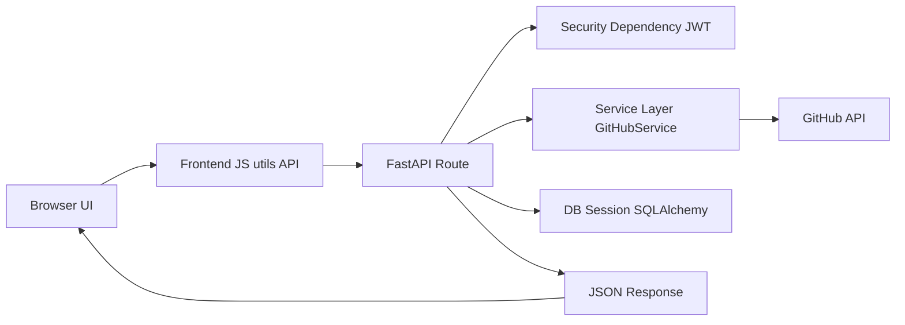

# OneLink Request Life Cycle

This document explains how requests move through the OneLink system, from browser actions to backend processing and back to the UI.

## 1. System Overview

- Frontend: static HTML/JS pages served from `FRONTEND/`
- Backend: FastAPI app in `backend/app/`
- External API: GitHub OAuth + GitHub REST API
- Storage: SQLite via SQLAlchemy models

## 2. High-Level Flow

## 3. Authentication Request Life Cycle

### 3.1 Login Start

1. User opens sign-in page.
2. Frontend triggers `GET /auth/login`.
3. Backend route in `auth.py` generates a random OAuth `state` and stores it temporarily.
4. Backend builds GitHub authorize URL using:
   - `client_id`
   - `redirect_uri`
   - `state`
   - `scope`
5. Backend redirects browser to GitHub consent page.

### 3.2 GitHub Callback

1. GitHub redirects to `GET /auth/callback?code=...&state=...`.
2. Backend validates `state`.
3. Backend exchanges `code` for GitHub access token.
4. Backend requests GitHub user profile.
5. Backend creates or updates local `User` record.
6. Backend creates JWT (`sub = user.id`).
7. Backend redirects to frontend callback URL with JWT in query string.
8. Frontend stores JWT and user data in local storage.

## 4. Dashboard Data Request Life Cycle

### 4.1 Protected API Calls

1. Dashboard loads and checks auth state.
2. Frontend JS uses shared `API.get/post/put/delete` helpers.
3. Each request includes `Authorization: Bearer <jwt>`.
4. FastAPI dependency `get_current_user`:
   - validates JWT
   - extracts `sub`
   - loads user from DB
5. Route handler executes business logic and returns JSON.
6. Frontend renders returned data into dashboard sections.

## 5. GitHub Sync Request Life Cycle (`POST /projects/sync`)

1. User clicks `Sync GitHub` button in dashboard.
2. Frontend calls `POST /projects/sync` with JWT header.
3. Backend validates user via `get_current_user`.
4. `sync_user_projects` runs:
   - checks user has GitHub access token
   - fetches user repos from GitHub
   - skips forked and archived repos
   - fetches language stats per repo
   - fetches README content per repo
   - detects possible demo URL
   - classifies status (`deployed`, `in_progress`, `code_only`)
   - upserts projects in local DB
   - updates `user.last_sync`
5. Backend responds with sync summary.
6. Frontend refreshes profile/project data and shows toast.

## 6. Data Persistence Flow

- SQLAlchemy models define tables (`User`, `Project`, `Experience`, `Education`, `Skill`, `Media`).
- Each route gets a DB session from `get_db`.
- Changes are committed in route/service logic.
- Updated records are returned in response models.

## 7. Error Path Summary

- Missing/invalid JWT: `401` from auth dependency.
- Missing GitHub token on sync: `400` from `/projects/sync`.
- GitHub API failure: service returns safe defaults (`None`, `{}`, or `[]`), sync continues where possible.
- Missing OAuth env values: app startup can fail with settings validation error.

## 8. Redirect URI Notes (Important)

GitHub requires an exact callback URL match.

- Backend uses `GITHUB_OAUTH_REDIRECT_URI`.
- Backward compatibility also accepts `GITHUB_REDIRECT_URI`.
- The value must match the GitHub OAuth App callback exactly, for example:
  - `http://localhost:8000/auth/callback`

Any mismatch causes:

- `The redirect_uri is not associated with this application.`

## 9. Quick Debug Checklist

1. Backend is running and reachable on port `8000`.
2. Frontend is served on expected origin (`3000` in local setup).
3. OAuth app callback URL exactly matches backend redirect URI.
4. `.env` has valid `GITHUB_CLIENT_ID` and `GITHUB_CLIENT_SECRET`.
5. JWT is present in local storage and sent in `Authorization` header.
6. `POST /projects/sync` returns `200` with `synced_count`.

## 10. Related Source Files

- `backend/app/main.py`
- `backend/app/api/auth.py`
- `backend/app/api/projects.py`
- `backend/app/core/security.py`
- `backend/app/core/config.py`
- `backend/app/services/github_service.py`
- `FRONTEND/shared/utils.js`
- `FRONTEND/pages/dashboard.html`
